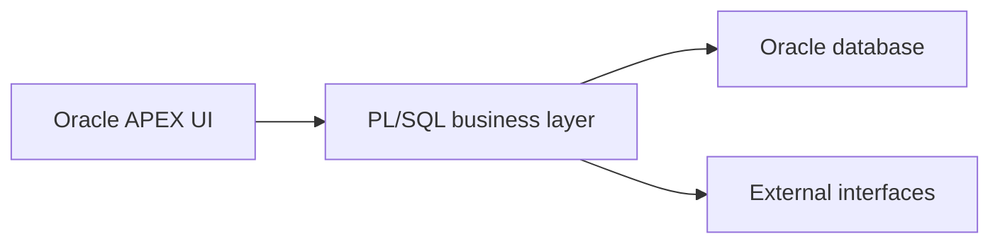

# System Architecture

Describe main components and integration boundaries. Mark any assumed flow as **Needs Review**.

```mermaid
flowchart LR
  A[Oracle APEX UI] --> B[PL/SQL business layer]
  B --> C[Oracle database]
  B --> D[External interfaces]
```

This is an illustrative diagram, not a verified production architecture.
